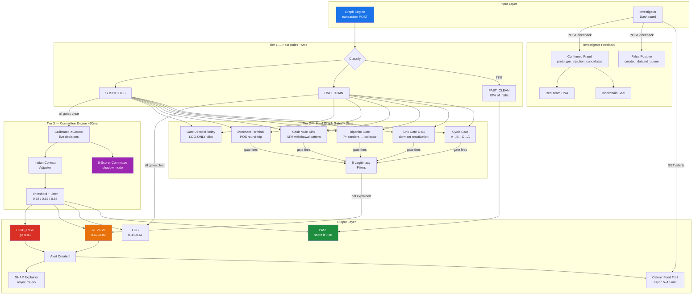
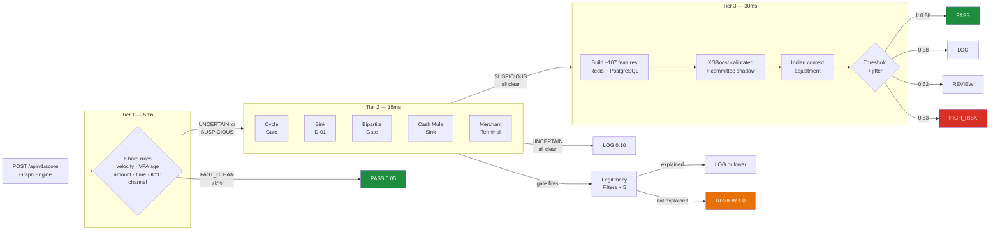
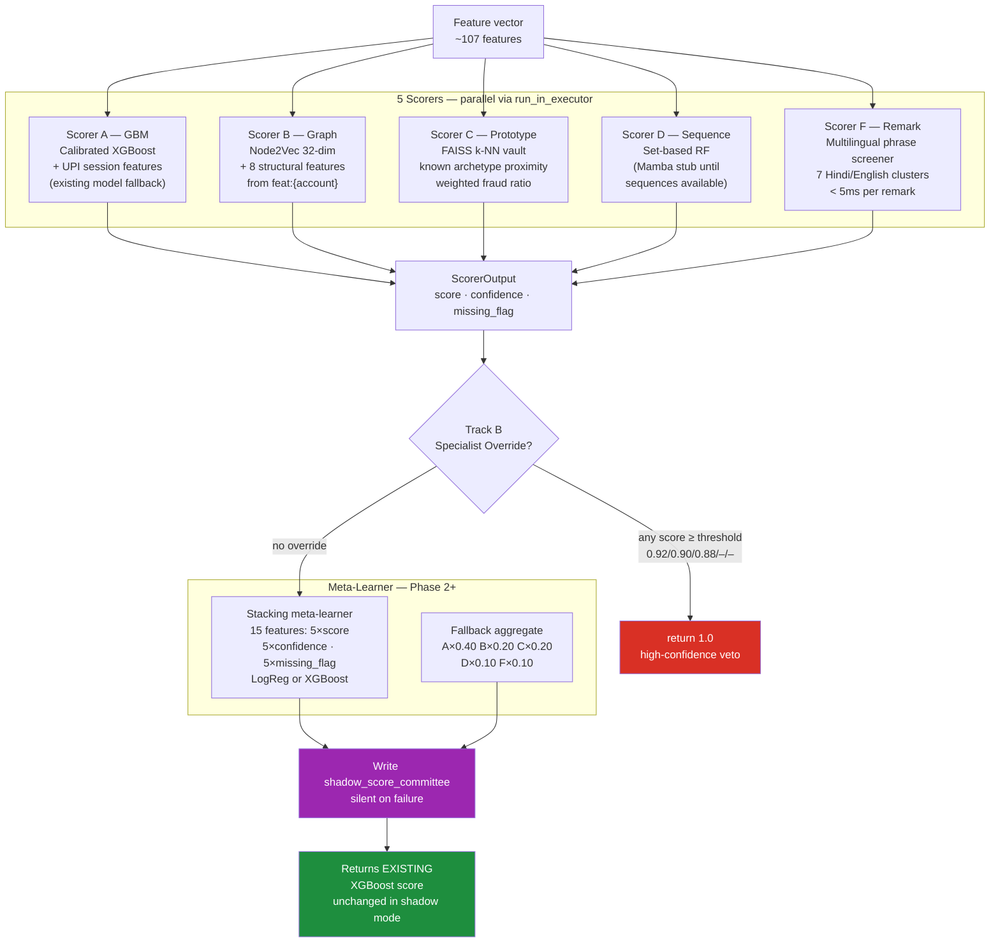
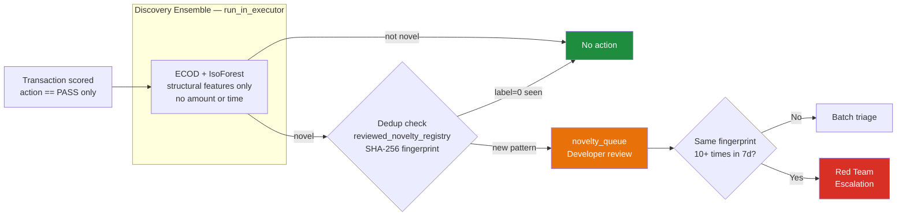
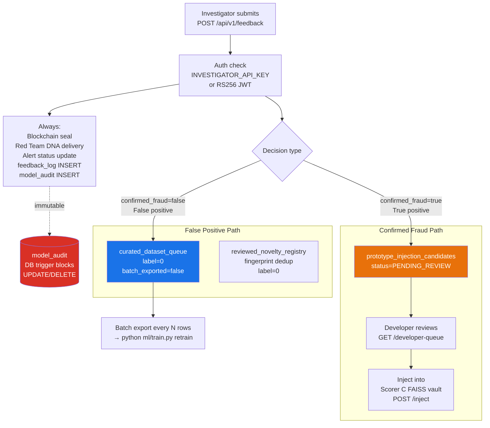
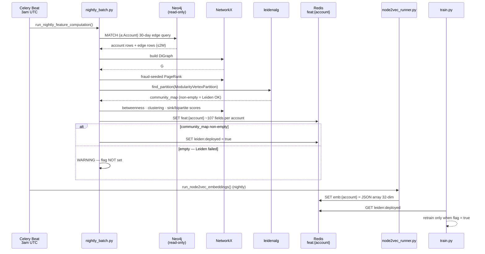
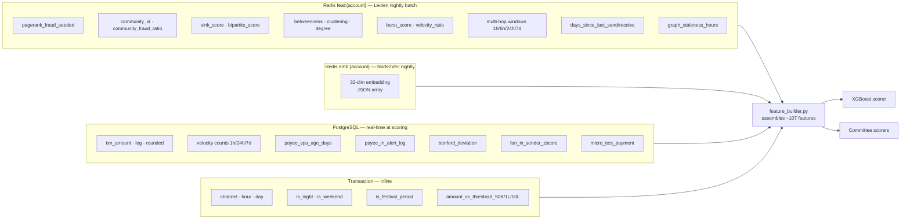
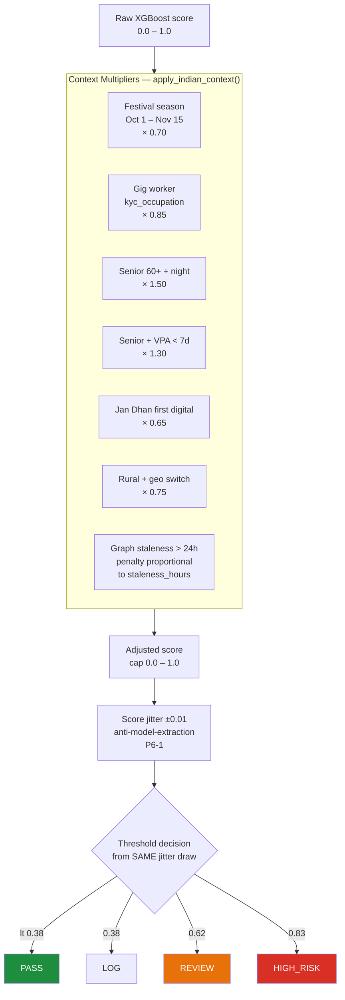
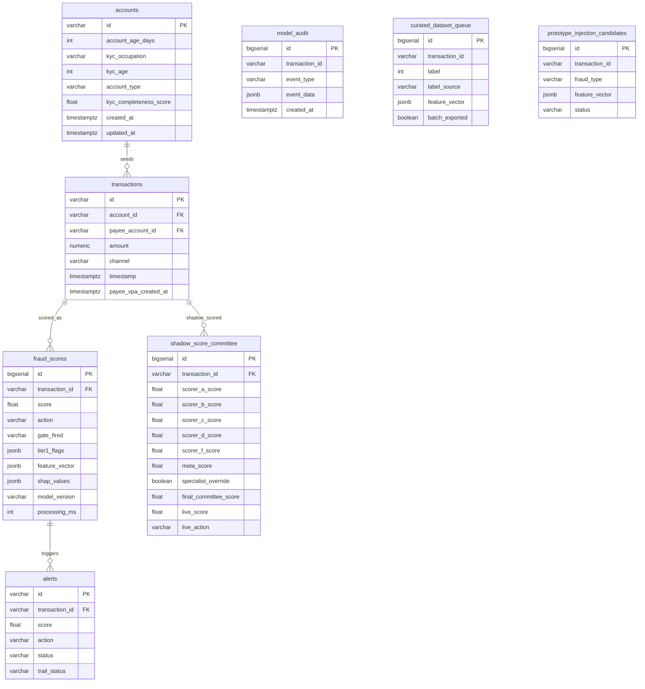

<div align="center">

# BLING Blue Team
### Forensic Fraud Detection Engine — Union Bank of India

[](https://python.org)
[](https://fastapi.tiangolo.com)
[](https://xgboost.readthedocs.io)
[](https://postgresql.org)
[](https://redis.io)
[](https://neo4j.com)
[](tests/)
[](alembic/versions/)

</div>

---

## What This Is

Post-transaction forensic fraud detection engine for Indian UPI payments. Money has already moved. This system scores every settled transaction, reconstructs fund trails when suspicious, and delivers SHAP-explained evidence bundles with draft STR reports (156 FINnet fields) to human investigators.

> **Core principle:** Investigators stay in control at every decision point. No automated blocking. Full explainability on every alert.

---

## Full System Architecture



---

## 3-Tier Detection Pipeline



---

## Tier 3 — 5-Scorer Committee Engine

Committee runs in **shadow mode** alongside the existing XGBoost. Every SUSPICIOUS-path transaction writes to `shadow_score_committee`. Live decisions unchanged until ≥50K shadow rows and meta-learner trained.



---

## Discovery Pipeline — PASS Stream Only



> **Invariant:** Anomaly score **never** enters `fraud_score`. Investigators never see it. Only fires when `action == "PASS"`.

---

## Investigator Feedback Routing



---

## Nightly Graph Feature Pipeline



---

## The 5 Hard Graph Gates (Tier 2)

Gates fire `score=1.0` or pass through. No partial scores. Based on RBI FATF layering detection guidance.

| Gate | Detects | Key signal |
|------|---------|-----------|
| **Cycle** | Circular fund trails A→B→C→A (2-8 hops) | `cycle_membership` — Leiden nightly batch |
| **Sink D-01** | Dormant account suddenly receives large inflow | `days_since_last_send` from Redis — NOT account age |
| **Bipartite** | 7+ senders → 1 collector (density >0.7) | `bipartite_score` |
| **Cash Mule Sink** | Receive → ATM withdrawal → digital silence | PostgreSQL only — no device ID needed |
| **Merchant Terminal** | Round-trip through POS terminal | `merchant_terminal_id` correlation |
| **Gate 0 Rapid Relay** | Relay ≥80% of inflow within 1h | **LOG-ONLY** until `GATE0_LIVE=true` |

After a gate fires, **5 legitimacy filters run in order** — internal/treasury → KYC relationship → salary advance → all-merchant → amount <70%. Never skipped. Never reordered.

---

## Feature Engineering

~107 total features across 4 groups. `ml/feature_registry.py` is the **single source of truth** — `train.py` and `feature_builder.py` both import from it. No file may hardcode a feature list.



---

## Indian Context Adjustment



> Score and action are always derived from the **same jitter draw** — prevents score/action inconsistency at boundaries.

---

## API Reference

### `POST /api/v1/score`
Auth: `GRAPH_ENGINE_API_KEY` or RS256 JWT · Rate limit: 1000/min

```json
// Request
{
  "transaction_id": "TXN_001",
  "account_id": "ACC123456789",
  "amount": "500000.00",
  "channel": "UPI",
  "timestamp": "2026-05-17T02:14:00Z",
  "payee_vpa": "recipient@upi",
  "payee_vpa_created_at": "2026-05-15T10:00:00Z"
}

// Response — always padded to 55ms (timing oracle prevention)
{
  "transaction_id": "TXN_001",
  "score": 0.9654,
  "action": "HIGH_RISK",
  "gate_fired": null,
  "alert_id": "a1b2c3d4-...",
  "processing_ms": 47
}
```

### `GET /api/v1/alerts/{alert_id}`
Auth: `INVESTIGATOR_API_KEY` or JWT — evidence package: fund trail + SHAP values + committee breakdown + STR draft (156 FINnet fields).

### `POST /api/v1/feedback`
Auth: `INVESTIGATOR_API_KEY` — false positive → `curated_dataset_queue`; confirmed fraud → `prototype_injection_candidates` + blockchain + Red Team.

### `GET/POST /api/v1/developer-queue/prototype-candidates`
Auth: `INTERNAL_API_KEY` only — review and inject confirmed novel fraud prototypes into Scorer C FAISS vault.

### `GET/POST /api/v1/internal/model/versions` · `/activate`
Auth: `INTERNAL_API_KEY` only — model versioning and rollback with SHA-256 integrity check (P6-2).

### `POST /api/v1/analyze-graph`
Auth: any valid key — pure NetworkX topology analysis on a graph snapshot. No DB required.

---

## 16+ Fraud Archetypes

| Archetype | Description | Test Score |
|-----------|-------------|-----------|
| `structuring` | Multiple txns just below ₹50K/₹1L/₹10L | 0.867 |
| `romance_scam` | Escalating transfers to new VPA | 0.845 |
| `pig_butchering` | Small trust-building then large exit | 0.833 |
| `merchant_terminal` | Round-trip through POS | 0.813 |
| `cash_in_mule` | Cash deposit → digital → ATM | 0.813 |
| `otp_fraud` | Failed attempts → success post-OTP | 0.803 |
| `digital_arrest` | Senior + night + large + new VPA | 0.802 |
| `investment_fraud` | High return promise + crypto gateway | 0.807 |
| `account_takeover` | Device change + velocity + new payees | 0.799 |
| `low_slow_mule` | 45-day warmup then 1.8L spike at 2am | 0.798 |
| `cycle_round_trip` | Circular flow — Tier 2 gate catches | 0.794 |
| `salary_mule` | Legit salary in, immediately forwarded | 0.768 |
| `rapid_layering` | 4+ hops, declining amounts, <20min | 0.759 |
| `sim_swap` | Device change + immediate high-value UPI | 0.745 |
| `ghost_node_cash` | ATM withdrawal + deposit different city 18h later | 0.706 |
| `bipartite_mule` | 7+ senders → 1 collector, density 0.85 | 0.698 |
| `hawala` | Informal value transfer network pattern | Phase 3 |
| `crypto_on_ramp` | Cash → crypto gateway layering | Phase 3 |
| `benami` | Nominee account concealment pattern | Phase 3 |

---

## Database Schema



Migrations: `001 → 002 → 003 → 004 → 005 → 006 → 007` (current head)

---

## How to Run

```bash
# Infrastructure
docker-compose up -d

# Env setup
cp .env.example .env   # fill credentials — see .env.example for all vars

# Database
alembic upgrade head   # runs migrations 001 → 007

# Build committee engine assets
python ml/scripts/build_phrase_dict.py        # Scorer F phrase embeddings
python ml/scripts/build_initial_prototypes.py # Scorer C FAISS vault seed

# Train models
python ml/train.py                    # XGBoost + Platt calibration (~2 min)
python ml/train_isolation_forest.py   # IsoForest base (~30 sec)

# Seed Redis + demo data
python scripts/seed_redis.py
python scripts/generate_test_data.py && python scripts/load_sample_data.py

# Start Celery (separate terminal)
celery -A app.celery_app worker -l info -Q default,evidence,graph
celery -A app.celery_app beat -l info

# Start API
uvicorn app.main:app --reload --port 8000

# Verify
curl http://localhost:8000/health
pytest tests/ -v   # 102+ passing
```

---

## Tech Stack

| Layer | Technology |
|-------|-----------|
| API | FastAPI 0.111 + Uvicorn |
| ML scoring | XGBoost 2.x + Platt calibration + SHAP 0.44 |
| Committee | 5-scorer committee engine (shadow mode → live Phase 5) |
| Discovery | IsolationForest + ECOD (PASS stream only) |
| Prototype vault | FAISS-cpu k-NN |
| Phrase screener | sentence-transformers (multilingual MiniLM, CPU-fast) |
| Graph features | Leiden community + Node2Vec (leidenalg + igraph + networkx) |
| Primary DB | PostgreSQL 15 (JSONB, pgcrypto, INET, BIGSERIAL) |
| Graph DB | Neo4j Community 5.x (read-only) |
| Cache | Redis 7.x (AOF persistence, connection pool, ZSET velocity windows) |
| Async tasks | Celery 5.x (fund trail, SHAP, graph refresh, betweenness) |
| Scheduler | Celery Beat (nightly 3am · betweenness 2h · micro-batch 5min) |
| Auth | X-API-Key per caller + RS256 JWT (dual mode, P1-7) |
| Compliance | FINnet 2.0 stub · NPCI pre-settlement stub · DPDP Act 2023 |
| Sanctions | OFAC + UN + MHA India (Redis SET, atomic rename, daily sync) |
| Observability | structlog + Prometheus |
| Deployment | Docker + Docker Compose |

---

## Security

| Concern | Implementation |
|---------|---------------|
| Auth | X-API-Key per caller + RS256 JWT; router-level `Depends()` |
| Rate limiting | 1000/min POST /score · per-endpoint via slowapi |
| SQL injection | Parameterized queries only — zero f-strings in any SQL |
| PII in logs | `HMAC-SHA256(PSEUDONYMIZATION_KEY, account_id)[:12]` |
| HTTP headers | HSTS · X-Frame-Options DENY · X-Content-Type-Options · CSP |
| Secrets | `.env` only — never in source, never logged |
| Audit integrity | DB trigger blocks UPDATE/DELETE on `model_audit` (RBI PMLA §12) |
| Anti-model-extraction | ±0.01 jitter before threshold decision; constant 55ms response time |
| Model integrity | SHA-256 sidecar hashes verified at startup (P0-3) |
| Sanctions | OFAC + UN + MHA lists; atomic Redis rename (no race window) |
| SMTP | STARTTLS enforced before send on port 587 |

---

## Core Invariants

1. No automated blocking. Investigators decide at every decision point.
2. XGBOD / IsolationForest / ECOD scores **never** enter `fraud_score`. Investigators never see them.
3. Gate 0 (rapid relay) is LOG-ONLY until `GATE0_LIVE=true` after 2-week pilot review.
4. SHAP always runs on uncalibrated base XGBoost — **never** on `CalibratedClassifierCV`.
5. Leiden + XGBoost retrain deploy atomically. `leiden:deployed` flag set only when `community_map` is non-empty.
6. `feature_registry.py` is the only place feature names/order are defined.
7. `model_audit` INSERT is atomic with every scoring response — if it fails, the request fails.
8. Blue Team never writes to Neo4j.
9. Score and action always derive from the **same jitter draw**.
10. Shadow failures (write to `shadow_score_committee`) never raise to caller or affect live score.

---

## Teammate Integration

| Teammate | Direction | What |
|---------|-----------|------|
| Graph Engine | → Blue Team | POST /api/v1/score per settled transaction |
| Graph Engine | → Neo4j | Builds live graph — Blue Team reads only |
| Investigator Dashboard | → Blue Team | GET /alerts/{id} · POST /feedback |
| Blockchain | ← Blue Team | Seals evidence on confirmed fraud |
| Red Team | ← Blue Team | Fraud DNA on feedback + novelty escalations |

---

<div align="center">
<b>BLING Hackathon · Blue Team · Union Bank of India</b><br>
Post-transaction forensic fraud detection with graph intelligence<br><br>
<i>102+ tests · 7 migrations · ~107 features · 5-scorer committee · 16+ archetypes</i>
</div>
