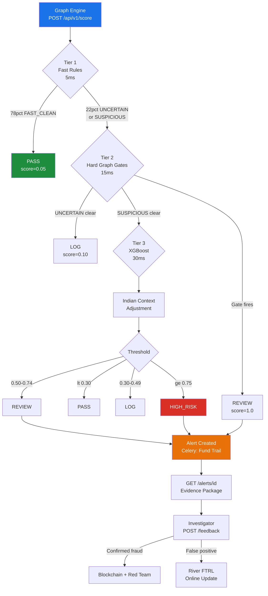
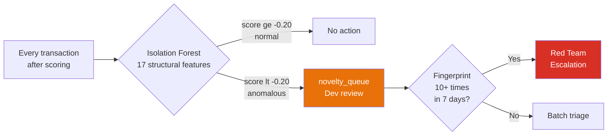

<div align="center">

# 🔵 BLING Blue Team
### Forensic Fraud Detection Engine — Union Bank of India

[](https://python.org)
[](https://fastapi.tiangolo.com)
[](https://xgboost.readthedocs.io)
[](https://postgresql.org)
[](https://redis.io)
[](tests/)

</div>

---

## What This Is

Post-transaction forensic fraud detection engine. Money has already moved. This system scores every settled transaction, reconstructs fund trails when suspicious, and delivers SHAP-explained evidence bundles with draft STR reports to human investigators.

> Investigators stay in control at every decision point. No automated blocking. Full explainability on every alert.

---

## Architecture

### 3-Tier Detection Pipeline



### Silent Novelty Sensor (Isolation Forest)



> **Core invariant:** Isolation Forest result **never** enters `fraud_score`. Investigators never see it.

---

## The 5 Hard Graph Gates (Tier 2)

Gates fire `score=1.0` or pass through. No partial scores. Based on RBI FATF layering detection guidance.

| Gate | Detects | Key signal |
|------|---------|-----------|
| **Cycle** | Circular fund trails A→B→C→A (2-8 hops) | `cycle_membership` — nightly batch |
| **Sink** | Money accumulation without legitimate outflow | `sink_score = retention × inflow_concentration` |
| **Bipartite** | 7+ senders → 1 collector (density >0.7) | `bipartite_score` |
| **Cash Mule Sink** | Receive → ATM withdrawal → digital silence | PostgreSQL only — no device ID needed |
| **Merchant Terminal** | Round-trip through POS terminal | `merchant_terminal_id` correlation |

After a gate fires, **5 legitimacy filters run in order** — internal/treasury → KYC relationship → salary advance → all-merchant → amount <70%. If none explain it: REVIEW, gate name logged. Never silent.

---

## XGBoost Ensemble (Tier 3)

**310,000 training examples** — 100K synthetic Indian archetypes + 200K BAF NeurIPS 2022 + 10K banking risk dataset

| Metric | Value |
|--------|-------|
| AUCPR | 0.69 |
| Fraud mean score | 0.787 |
| Clean mean score | 0.160 |
| `scale_pos_weight` | ~49× (class ratio) |

59 total features: 35 graph (pre-computed nightly into Redis) + 24 real-time tabular.

<details>
<summary>Full 59-feature list</summary>

**Graph structure — Redis, updated nightly (35 features)**

| Feature | Measures |
|---------|---------|
| `pagerank_fraud_seeded` | Proximity to confirmed fraud nodes |
| `betweenness_centrality` | Bridge between communities? |
| `clustering_coefficient` | Neighborhood connectivity |
| `degree_centrality` | Connections relative to graph size |
| `community_id` | Louvain community |
| `community_fraud_ratio` | % of community flagged fraud |
| `shortest_path_to_fraud` | Min hops to fraud node |
| `cycle_membership` | Part of detected cycle? |
| `sink_score` | Money in vs money out |
| `bipartite_score` | Many-to-one fan-in density |
| `fan_out_ratio` | Out-degree / in-degree |
| `temporal_acceleration` | Txn frequency trend |
| `cash_mule_sink_score` | Receive + withdraw + dormant composite |
| `bridge_node_probability` | Bridges clean and dirty money? |
| `dormancy_reactivation_flag` | Dormant then suddenly active |
| `account_age_days` | Days since account opened |
| `kyc_completeness_score` | KYC docs completeness 0-1 |
| `txn_count_30d / 90d / all` | Count by window |
| `avg_txn_amount_30d` | Avg amount last 30d |
| `distinct_counterparties_30d` | Unique payees last 30d |
| `channel_entropy` | Payment channel diversity |
| `night_txn_ratio` | Fraction 10pm-5am |
| `weekend_txn_ratio` | Fraction on weekends |
| `return_ratio` | Received and immediately forwarded |
| `amount_zscore` | Deviation from historical |
| `counterparty_novelty` | New payees fraction |
| `hour_deviation` | Deviation from typical hour |
| `channel_switch` | Unusual channel for this account |
| `amount_series_score` | Below-threshold structuring signal |
| `burst_score` | Velocity spike vs baseline |
| `velocity_ratio` | Current rate / historical avg |
| `dormancy_break` | Days since last activity |
| `geography_switch` | New location vs history |

**Real-time tabular — computed at scoring time (24 features)**

`txn_amount` · `txn_amount_log` · `txn_amount_rounded` · `channel_upi/imps/rtgs/neft` · `hour_of_day` · `day_of_week` · `is_weekend` · `is_night` · `is_festival_period` · `amount_vs_threshold_50000/100000/1000000` · `payee_vpa_age_days` · `txn_count_last_1h/24h/7d` · `txn_volume_last_1h/24h` · `distinct_payees_24h` · `payee_in_alert_log` · `payee_shared_alert_count`

</details>

### Indian Context Adjustment (post-XGBoost multipliers)

| Scenario | Multiplier | Why |
|----------|-----------|-----|
| Festival season (Diwali/Holi/Eid/Navratri) | ×0.70 | Family gift transfers spike legitimately |
| Gig worker account | ×0.85 | Irregular income mimics velocity bursts |
| Senior (>60) + night transaction | ×1.50 | Digital arrest scams target seniors at night |
| Senior + payee VPA <7 days old | ×1.30 | New VPA + senior = strong scam signal |
| Jan Dhan + first digital payment | ×0.65 | First-time digital users look unusual by definition |
| Rural + state geography switch | ×0.75 | Seasonal migration is normal |

---

## 16 Fraud Archetypes

| Archetype | Description | Test Score |
|-----------|-------------|-----------|
| `structuring` | Multiple txns just below ₹50K/₹1L/₹10L | 0.867 |
| `romance_scam` | Escalating transfers to new VPA | 0.845 |
| `pig_butchering` | Small trust-building then large exit | 0.833 |
| `merchant_terminal` | Round-trip through POS | 0.813 |
| `cash_in_mule` | Cash deposit → digital → ATM | 0.813 |
| `otp_fraud` | Failed attempts → success post-OTP | 0.803 |
| `digital_arrest` | Senior + night + large + new VPA | 0.802 |
| `investment_fraud` | High return promise + crypto gateway | 0.807 |
| `account_takeover` | Device change + velocity + new payees | 0.799 |
| `low_slow_mule` | 45-day warmup then 1.8L spike at 2am | 0.798 |
| `cycle_round_trip` | Circular flow — Tier 2 gate catches | 0.794 |
| `salary_mule` | Legit salary in, immediately forwarded | 0.768 |
| `rapid_layering` | 4+ hops, declining amounts, <20min | 0.759 |
| `sim_swap` | Device change + immediate high-value UPI | 0.745 |
| `ghost_node_cash` | ATM withdrawal + deposit different city 18h later | 0.706 |
| `bipartite_mule` | 7+ senders → 1 collector, density 0.85 | 0.698 |

---

## Isolation Forest — Novel Pattern Sensor

The IF runs **silently after every transaction is scored**. Fraud score is never changed.

**Why it exists:** XGBoost catches known patterns. Adversaries iterate. The IF watches for structural anomalies that don't match any legitimate account — catching new evasion techniques before anyone has written a gate for them.

**17 structural features only** — time and amount features excluded (night-owls and pension recipients should not be flagged as novel).

### Developer workflow

```bash
# View pending novelty flags
curl "http://localhost:8000/api/v1/novelty/queue" \
  -H "X-API-Key: $INTERNAL_API_KEY"

# Escalated patterns only (same fingerprint 10+ times)
curl "http://localhost:8000/api/v1/novelty/queue?escalation_only=true" \
  -H "X-API-Key: $INTERNAL_API_KEY"

# Mark as confirmed new fraud pattern — then write a gate for it
curl -X PATCH "http://localhost:8000/api/v1/novelty/42/review" \
  -H "X-API-Key: $INTERNAL_API_KEY" \
  -H "Content-Type: application/json" \
  -d '{"status":"REVIEWED_NEW_FRAUD","developer_notes":"SIM swap variant — write gate"}'
```

---

## API Reference

### `POST /api/v1/score`
Auth: `GRAPH_ENGINE_API_KEY` · Rate limit: 1000/min

```json
// Request
{
  "transaction_id": "TXN_001",
  "account_id": "ACC123456789",
  "amount": "500000.00",
  "channel": "UPI",
  "timestamp": "2026-05-17T02:14:00Z",
  "payee_vpa": "recipient@upi",
  "payee_vpa_created_at": "2026-05-15T10:00:00Z"
}

// Response
{
  "transaction_id": "TXN_001",
  "score": 0.9654,
  "action": "HIGH_RISK",
  "gate_fired": null,
  "alert_id": "a1b2c3d4-...",
  "processing_ms": 47
}
```

### `GET /api/v1/alerts/{alert_id}`
Auth: `INVESTIGATOR_API_KEY` — fund trail + SHAP values + STR draft (156 FINnet fields)

### `POST /api/v1/feedback`
Auth: `INVESTIGATOR_API_KEY` — triggers blockchain seal + Red Team DNA + River FTRL update

---

## How to Run

```bash
# Infrastructure
docker-compose up -d

# Env setup
cp .env.example .env   # fill credentials

# Database
python scripts/init_db.py
alembic upgrade head

# Train models
python ml/train.py                    # XGBoost (~2 min)
python ml/train_isolation_forest.py   # Isolation Forest (~30 sec)

# Seed Redis + demo data
python scripts/seed_redis.py
python scripts/generate_test_data.py && python scripts/load_sample_data.py

# Start API
uvicorn app.main:app --reload --port 8000

# Verify
curl http://localhost:8000/health   # {"status": "ok"}
pytest tests/ -v                   # 23 passing
```

---

## Database

| Table | Purpose | Mutable? |
|-------|---------|---------|
| `accounts` | KYC data from core banking | Read-only by Blue Team |
| `transactions` | Settled transaction records | Append-only |
| `fraud_scores` | Scoring result + SHAP + feature vector | Append |
| `alerts` | Created when score ≥ REVIEW | Investigator updates |
| `feedback_log` | Investigator decisions | Append-only |
| `graph_features_cache` | Nightly pre-computed graph features | Updated nightly |
| `model_audit` | **IMMUTABLE** RBI PMLA §12 audit trail | INSERT only (DB enforced) |
| `novelty_queue` | Isolation Forest findings for developers | Developer updates |

**Redis keys:**

| Key | Purpose | TTL |
|-----|---------|-----|
| `vel:1h:{account}` | Velocity counter 1-hour | 3600s |
| `vel:24h:{account}` | Velocity counter 24-hour | 86400s |
| `feat:{account}` | 35 pre-computed graph features | 26h |
| `novelty:fp:{fp}` | Novelty fingerprint occurrence count | 7 days |

---

## Tech Stack

| Layer | Technology |
|-------|-----------|
| API | FastAPI 0.111 + Uvicorn |
| ML scoring | XGBoost 2.x + SHAP 0.44 |
| Online learning | River 0.21 FTRL |
| Novelty detection | scikit-learn IsolationForest |
| Primary DB | PostgreSQL 15 |
| Graph DB | Neo4j Community 5.x (read-only) |
| Cache | Redis 7.x |
| Async tasks | Celery |
| Scheduler | APScheduler 3.x |
| Observability | structlog + Prometheus |
| Deployment | Docker + Docker Compose |

---

## Security

| Concern | Implementation |
|---------|---------------|
| Auth | X-API-Key per caller, router-level |
| Rate limiting | 1000/min on POST /score (slowapi) |
| SQL injection | Parameterized queries only |
| PII in logs | `sha256(SALT + account_id)[:12]` |
| Secrets | `.env` only |
| Audit integrity | DB triggers block UPDATE/DELETE on `model_audit` |
| Input validation | Pydantic v2 at every boundary |

---

## File Map

```
app/
├── api/v1/         score.py · alert.py · feedback.py · novelty.py · health.py
├── detection/      pipeline.py · tier1/ · tier2/ (5 gates) · tier3/ · context/ · novelty/
├── evidence/       trail_builder.py (Celery) · str_generator.py
├── graph/          neo4j_client.py · queries/ · precompute/nightly_batch.py
├── integrations/   blockchain_client.py · red_team_client.py
└── utils/          redis_client.py · audit_logger.py · metrics.py

ml/
├── train.py                      XGBoost (310K rows, 16 archetypes)
├── train_isolation_forest.py     IF (legit-only, 17 features)
├── baf_graph_bridge.py           BAF NeurIPS 2022 → graph schema
└── deepesh_bridge.py             Banking risk dataset → graph schema

alembic/versions/
├── 001_initial_schema.py         7 core tables
└── 002_add_novelty_queue.py      novelty_queue table

tests/
├── test_integration/test_fraud_scenarios.py   8 fraud scenarios (all pass)
└── test_novelty/test_isolation_forest.py      15 novelty + separation tests
```

---

## Teammate Integration

| Teammate | Direction | What |
|---------|-----------|------|
| Graph Engine | → Blue Team | POST /api/v1/score per settled transaction |
| Graph Engine | → Neo4j | Builds live graph — Blue Team reads only |
| Investigator Dashboard | → Blue Team | GET /alerts/{id} · POST /feedback |
| Blockchain | ← Blue Team | Seals evidence on confirmed fraud |
| Red Team | ← Blue Team | Fraud DNA on feedback + novelty escalations |

---

<div align="center">
<b>BLING Hackathon · Blue Team · Union Bank of India</b><br>
Post-transaction forensic fraud detection with graph intelligence
</div>
