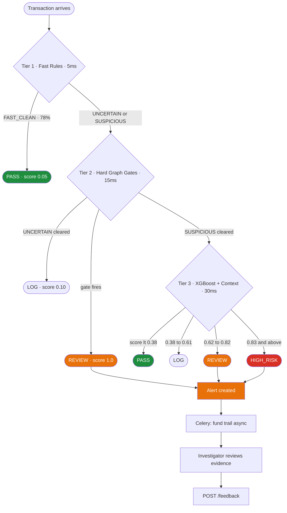
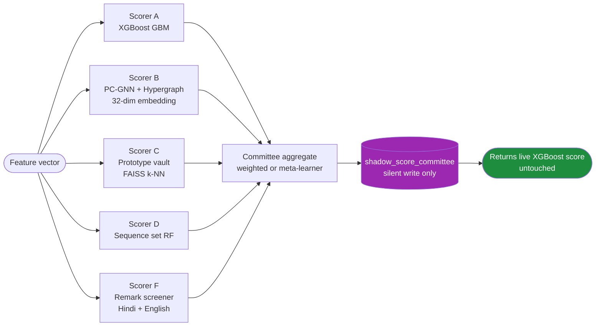
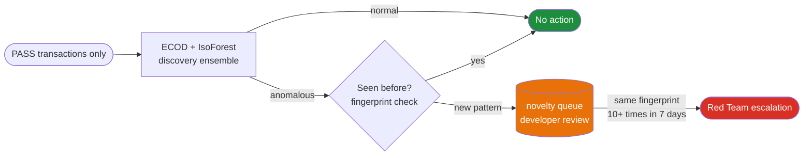
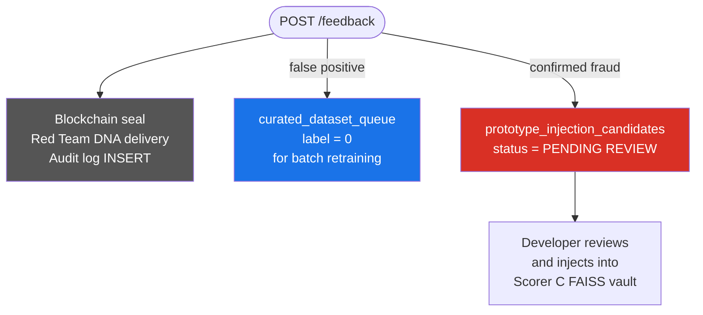

<div align="center">

# BLING Blue Team
### Forensic Fraud Detection Engine — Union Bank of India

[](https://python.org)
[](https://fastapi.tiangolo.com)
[](https://xgboost.readthedocs.io)
[](https://pyg.org)
[](https://postgresql.org)
[](https://redis.io)
[](https://neo4j.com)
[](tests/)
[](alembic/versions/)

</div>

---

## What This Is

Post-transaction forensic fraud detection engine for Indian UPI payments. Money has already moved. This system scores every settled transaction, reconstructs fund trails when suspicious, and delivers SHAP-explained evidence bundles with draft STR reports to human investigators.

> **Core principle:** Investigators stay in control at every decision point. No automated blocking. Full explainability on every alert.

---

## Detection Pipeline

Every transaction from the Graph Engine flows through 3 tiers in order.



---

## Tier 2 — The 5 Hard Graph Gates

Each gate is a **hard veto** — fires REVIEW at score 1.0 or passes through. After a gate fires, 5 legitimacy filters run in order before escalating (internal treasury → KYC relationship → salary advance → all-merchant → amount below 70%).

| Gate | What it detects | Key signal |
|------|----------------|-----------|
| **Cycle** | Circular fund trail A → B → C → A | `cycle_membership` in Redis |
| **Sink D-01** | Dormant account suddenly receives large inflow | `days_since_last_send` from Redis |
| **Bipartite** | 7+ senders feeding one collector (density > 0.7) | `bipartite_score` in Redis |
| **Cash Mule Sink** | Receive digitally → withdraw at ATM → go silent | PostgreSQL only — no device ID |
| **Merchant Terminal** | Round-trip through POS terminal | `merchant_terminal_id` match |
| **Gate 0 Rapid Relay** | Forwards ≥ 80% of inflow within 1 hour | LOG-ONLY until `GATE0_LIVE=true` |

---

## Tier 3 — Committee Engine (Shadow Mode)

Five specialist scorers run alongside the live XGBoost. Their outputs write to `shadow_score_committee` only — zero impact on live decisions until the meta-learner is trained on ≥ 50K shadow rows.



---

## Discovery Pipeline — PASS Stream Only

The anomaly detector watches only transactions that scored **PASS**. It never touches fraud scores or creates investigator alerts.



---

## Investigator Feedback Routing

After an investigator submits a decision, the system routes the outcome to two separate queues depending on whether the alert was a real fraud or a false positive.



---

## How to Run

```bash
# 1. Start infrastructure
docker-compose up -d

# 2. Fill in credentials
cp .env.example .env

# 3. Run all migrations (001 → 007)
alembic upgrade head

# 4. Build committee engine assets
python ml/scripts/build_phrase_dict.py          # Scorer F — Hindi/English phrase embeddings
python ml/scripts/build_initial_prototypes.py   # Scorer C — FAISS prototype vault

# 5. Train all models (synthetic data — re-run after real data is available)
python ml/train.py --force           # XGBoost base + Platt calibration
python ml/train_scorer_a.py          # Scorer A GBM (113 features + UPI session)
python ml/train_scorer_b.py          # Scorer B MLP (PC-GNN embedding + structural)
python ml/train_scorer_d.py          # Scorer D RF (7 behavioral set features)
python ml/train_ecod.py              # ECOD anomaly detector (PASS stream)
python ml/train_xgbod.py             # XGBOD novelty layer (developer-only)
python ml/train_isolation_forest.py  # IsoForest discovery (PASS stream)
python ml/train_gnn.py --synthetic   # PC-GNN + Hypergraph embeddings → Redis gnn_emb:*

# 6. Seed Redis and load demo data
python scripts/seed_redis.py
python scripts/generate_test_data.py && python scripts/load_sample_data.py

# 7. Start Celery (separate terminal)
celery -A app.celery_app worker -l info -Q default,evidence,graph
celery -A app.celery_app beat -l info

# 8. Start API
uvicorn app.main:app --reload --port 8000

# 9. Verify
curl http://localhost:8000/health
pytest tests/ -v   # 102+ passing
```

---

## API Endpoints

| Method | Path | Auth | Purpose |
|--------|------|------|---------|
| `POST` | `/api/v1/score` | Graph Engine key | Score a settled transaction |
| `GET` | `/api/v1/alerts/{id}` | Investigator key | Evidence package + SHAP + STR draft |
| `POST` | `/api/v1/feedback` | Investigator key | Submit investigator decision |
| `POST` | `/api/v1/analyze-graph` | Any key | Pure graph topology analysis |
| `GET` | `/api/v1/developer-queue/prototype-candidates` | Internal key | Review novel fraud candidates |
| `POST` | `/api/v1/developer-queue/prototype-candidates/{id}/inject` | Internal key | Inject into Scorer C vault |
| `GET` | `/api/v1/internal/model/versions` | Internal key | List model versions |
| `POST` | `/api/v1/internal/model/activate` | Internal key | Rollback to a model version |
| `GET` | `/health` | None | Health check |
| `GET` | `/metrics` | None | Prometheus metrics |

**POST /api/v1/score — example:**

```json
{
  "transaction_id": "TXN_001",
  "account_id": "ACC123456789",
  "amount": "500000.00",
  "channel": "UPI",
  "timestamp": "2026-05-17T02:14:00Z",
  "payee_vpa": "suspect@upi",
  "payee_vpa_created_at": "2026-05-15T10:00:00Z"
}
```

```json
{
  "transaction_id": "TXN_001",
  "score": 0.9128,
  "action": "HIGH_RISK",
  "gate_fired": null,
  "alert_id": "a1b2c3d4-5678-...",
  "processing_ms": 47
}
```

Score includes ±0.01 jitter (anti-model-extraction). Action and score derive from the same jitter draw. All responses padded to 55ms constant time.

---

## Feature Engineering

~107 features assembled at scoring time. `ml/feature_registry.py` is the single source of truth — `train.py` and `feature_builder.py` both import from it.

| Source | Features | Updated |
|--------|----------|---------|
| Redis `feat:{account}` — Leiden nightly | 35 graph features (PageRank, sink score, community, betweenness, multi-hop windows) | Nightly 3am |
| Redis `gnn_emb:{account}` — PC-GNN + Hypergraph | 32-dim camouflage-resistant embedding (Scorer B primary source) | Nightly + 5-min refresh |
| Redis `emb:{account}` — Node2Vec | 32-dim embedding (Scorer B fallback when GNN not yet run for account) | Nightly |
| Redis `feat:{account}` — Phase 2 additions | ~10 features (graph staleness, temporal windows, days since send/receive) | Nightly |
| PostgreSQL — real-time | 24 tabular features (velocity, VPA age, payee alert history) | At scoring time |
| Phase 3 real-time | 6 features (Benford deviation, fan-in z-score, micro test payment) | At scoring time |

---

## 16+ Fraud Archetypes

Trained on 310K examples: 100K synthetic Indian archetypes + IEEE-CIS + ADBench blend.

| Archetype | Description | Score |
|-----------|-------------|-------|
| `structuring` | Multiple txns just below ₹50K / ₹1L / ₹10L | 0.867 |
| `romance_scam` | Escalating transfers to new VPA | 0.845 |
| `pig_butchering` | Small trust transfers then large exit | 0.833 |
| `merchant_terminal` | Round-trip through POS terminal | 0.813 |
| `cash_in_mule` | Cash deposit → digital → ATM | 0.813 |
| `digital_arrest` | Senior 60+ at 2am to 2-day-old VPA | 0.802 |
| `investment_fraud` | High return promise + crypto gateway | 0.807 |
| `otp_fraud` | Failed attempts → success post-OTP | 0.803 |
| `account_takeover` | Device change + velocity + new payees | 0.799 |
| `low_slow_mule` | 45-day normal behaviour then 1.8L spike at 2am | 0.798 |
| `cycle_round_trip` | Circular flow — caught by Tier 2 gate | 0.794 |
| `salary_mule` | Legitimate salary in, immediately forwarded | 0.768 |
| `rapid_layering` | 4+ hops, declining amounts, under 20 minutes | 0.759 |
| `sim_swap` | Device change + immediate high-value UPI | 0.745 |
| `ghost_node_cash` | ATM withdrawal in one city, deposit in another 18h later | 0.706 |
| `bipartite_mule` | 7 senders → 1 collector, density 0.85 | 0.698 |
| `hawala` | Informal value transfer network | Phase 3 |
| `crypto_on_ramp` | Cash → crypto gateway layering | Phase 3 |
| `benami` | Nominee account concealment | Phase 3 |

---

## Indian Context Adjustment

Applied after XGBoost scores, before threshold decision.

| Situation | Multiplier | Reason |
|-----------|-----------|--------|
| Festival season Oct 1 – Nov 15 | × 0.70 | Legitimate gift transfer spikes |
| Gig worker account | × 0.85 | Irregular income looks like velocity burst |
| Senior (60+) + night transaction | × 1.50 | Digital arrest scams target seniors at night |
| Senior + payee VPA under 7 days old | × 1.30 | New VPA + senior = strong scam signal |
| Jan Dhan first digital payment | × 0.65 | First-time users look anomalous by definition |
| Rural + geography switch | × 0.75 | Seasonal migration is normal |
| Graph staleness over 24 hours | penalty | Pre-computed features are stale |

---

## Database

| Table | Purpose | Write rule |
|-------|---------|-----------|
| `transactions` | Settled transaction records | Append-only |
| `fraud_scores` | Score + SHAP + feature vector | Append-only |
| `alerts` | Created when score ≥ REVIEW | Investigator updates status |
| `model_audit` | RBI PMLA §12 audit trail | INSERT only — DB trigger blocks UPDATE/DELETE |
| `shadow_score_committee` | All 5 committee scorer outputs | Append-only (shadow) |
| `curated_dataset_queue` | False positives for batch retraining | Append-only |
| `prototype_injection_candidates` | Confirmed fraud for Scorer C | Developer updates status |
| `reviewed_novelty_registry` | Discovery pipeline dedup store | Append-only |
| `meta_learner_versions` | Committee meta-learner history | Append-only |

Migrations: `001 → 002 → 003 → 004 → 005 → 006 → 007` (current head)

---

## Tech Stack

| Layer | Choice |
|-------|--------|
| API | FastAPI 0.111 + Uvicorn |
| ML scoring | XGBoost 2.x + Platt calibration + SHAP 0.44 |
| Committee | 5-scorer committee engine (shadow mode) |
| Graph embedding | PC-GNN (camouflage-resistant) + Hypergraph layer (Leiden community hyperedges) |
| Graph features | Leiden community detection + Node2Vec (fallback) |
| Discovery | IsolationForest + ECOD (PASS stream only) |
| Prototype vault | FAISS-cpu k-NN |
| Primary DB | PostgreSQL 15 |
| Graph DB | Neo4j 5.x (read-only) |
| Cache | Redis 7.x (AOF + connection pool) |
| Async tasks | Celery 5.x |
| Scheduler | Celery Beat (nightly · 2h betweenness · 5min micro-batch) |
| Auth | X-API-Key + RS256 JWT (dual mode) |
| Compliance | FINnet 2.0 · NPCI · DPDP Act 2023 · OFAC + UN sanctions |
| Observability | structlog + Prometheus |

---

## Core Invariants

1. No automated blocking — investigators decide at every step
2. Anomaly scores (IsoForest / ECOD / XGBOD) never enter `fraud_score` — never shown to investigators, developer novelty_queue only
3. Gate 0 is LOG-ONLY until `GATE0_LIVE=true` after 2-week pilot review
4. SHAP always runs on uncalibrated base XGBoost — never on `CalibratedClassifierCV`
5. Leiden deployed flag is set only when `community_map` is non-empty
6. `feature_registry.py` is the only place feature names and order are defined
7. `model_audit` INSERT is atomic with every scoring response — if it fails, the request fails
8. Blue Team never writes to Neo4j

---

## Teammate Integration

| Teammate | Direction | What |
|---------|-----------|------|
| Graph Engine | → Blue Team | `POST /api/v1/score` per settled transaction |
| Graph Engine | → Neo4j | Builds live graph — Blue Team reads only |
| Investigator Dashboard | → Blue Team | `GET /alerts/{id}` · `POST /feedback` |
| Blockchain | ← Blue Team | Seals evidence bundle on confirmed fraud |
| Red Team | ← Blue Team | Fraud DNA on confirmed feedback + novelty escalations |

---

<div align="center">
<b>BLING Hackathon · Blue Team · Union Bank of India</b><br>
Post-transaction forensic fraud detection · 102+ tests · 7 migrations · ~107 features · 19 archetypes · PC-GNN + Hypergraph GNN
</div>
